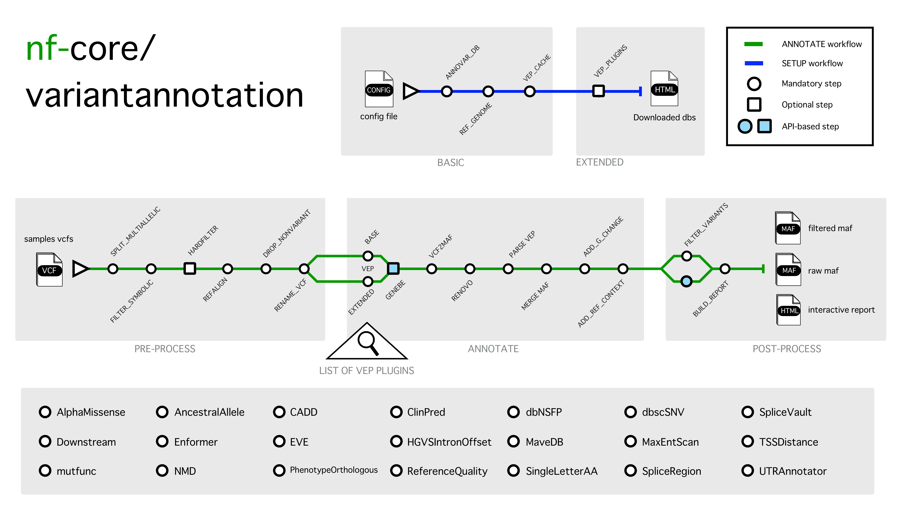

<h1>
  <picture>
    <source media="(prefers-color-scheme: dark)" srcset="docs/images/nf-core-variantannotation_logo_dark.png">
    
  </picture>
</h1>

[](https://github.com/codespaces/new/nf-core/variantannotation)
[](https://github.com/nf-core/variantannotation/actions/workflows/nf-test.yml)
[](https://github.com/nf-core/variantannotation/actions/workflows/linting.yml)[](https://nf-co.re/variantannotation/results)[](https://doi.org/10.5281/zenodo.XXXXXXX)
[](https://www.nf-test.com)

[](https://www.nextflow.io/)
[](https://github.com/nf-core/tools/releases/tag/3.5.1)
[](https://docs.conda.io/en/latest/)
[](https://www.docker.com/)
[](https://sylabs.io/docs/)
[](https://cloud.seqera.io/launch?pipeline=https://github.com/nf-core/variantannotation)

[](https://nfcore.slack.com/channels/variantannotation)[](https://bsky.app/profile/nf-co.re)[](https://mstdn.science/@nf_core)[](https://www.youtube.com/c/nf-core)

## Introduction

**nf-core/variantannotation** is a scalable and modular bioinformatics pipeline for comprehensive variant annotation. It integrates multiple industry-standard annotation tools and external databases to produce an ultra-deep annotated MAF (Mutation Annotation Format) file, along with an interactive HTML report for visual inspection and downstream interpretation.

The pipeline takes as input a samplesheet referencing raw (unannotated) VCF files and outputs consolidated annotation files suitable for clinical research, reporting, or input to downstream workflows.
If Human Phenotype Ontology (HPO) terms are provided for individual patients, an additional phenotype-prioritized MAF is generated using HPO-based gene panel filtering.

<!-- TODO nf-core:
   Complete this sentence with a 2-3 sentence summary of what types of data the pipeline ingests, a brief overview of the
   major pipeline sections and the types of output it produces. You're giving an overview to someone new
   to nf-core here, in 15-20 seconds. For an example, see https://github.com/nf-core/rnaseq/blob/master/README.md#introduction
-->



### Default pipeline key parameters

- **`--build`**  
  Genome build to use (default: `hg38`).

- **`--input`**  
  Path to the samplesheet containing input VCF files.

- **`--outdir`**  
  Directory where all results will be written.

- **`--workflow`**  
  Workflow to run: `setup` or `annotate`.

- **`--vcf_format`**  
  Format of input VCF files. Supported: `sarek`, `multicaller`, `dragen`, `iontorrent`.

- **`--center`**  
  Optional sequencing center identifier added to output files.

- **`--skip_bcftools`**  
  Allows user to skip the bcftools-based pre-processing of vcf files.

#### Genebe parameters *(required when `--offline false`)*

- **`--gb_user`**  
  Genebe account username.

- **`--gb_api_key`**  
  Genebe API key.

- **`--http_proxy`**, **`--https_proxy`**  
  Proxy settings, only if required by your system.


#### VEP and plugin parameters

- **`--n_core`**  
  Number of cores used by VEP (default: `16`).

- **`--download_vep_plugins`**  
  Download VEP plugins during the setup workflow (`true/false`).

- **`--use_vep_plugins`**  
  Enable VEP plugin usage during the annotation workflow (`true/false`).

- **`--data_dir`**  
  Directory containing all the data downloaded during the setup step.

- **`--annovar_software_dir`**  
  Directory containing the annovar software folder (path/to/annovar).


## Usage

> [!NOTE]
> If you are new to Nextflow and nf-core, please refer to [this page](https://nf-co.re/docs/usage/installation) on how to set up Nextflow. Make sure to [test your setup](https://nf-co.re/docs/usage/introduction#how-to-run-a-pipeline) with `-profile test` before running the workflow on actual data.

### 1a. Setup

Before annotating any dataset, the pipeline requires a **setup step** to download the minimal required databases and reference files. This ensures the pipeline can run correctly. ADDITIONAL NOTE: user have to get access to an ANNOVAR license and download link and install it.

Run the setup workflow:

```bash
nextflow run main.nf \
    -profile <docker/singularity> \
    --workflow setup \
    --download_vep_plugins=<true/false> \
    --data_dir="../data/"
```

### 1b. Test run

Now, you can run your first test using:

```bash
nextflow run main.nf \
   -profile test,<docker/singularity> \
   --use_vep_plugins = <true/false> \
   --annovar_software_dir = <path/to/annovar> \
   --outdir <OUTDIR>
```

### 2. Using your own data

If you want to annotate your own vcf file, make sure you prepare a samplesheet with this format:

| patient      | sample_type | sample_file         | hpo          |
|-------------|------------|-------------------|-------------|
| patient_code | tissue     | path/to/file.vcf.gz | HP:code (optional) |

**Columns:**

- `patient`: Unique identifier for the patient  
- `sample_type`: Type of sample (blood, saliva, tissue, etc.)  
- `sample_file`: Full path to the unannotated VCF file  
- `hpo`: Optional HPO term(s) for phenotype-based filtering  

> [!WARNING]
> By default, the entire pipeline is set to run with `--offline = true`.
This will skip the Genebe and HPO API-based annotations.
If you want to use Genebe, please provide `--gb_user` and `--gb_api_key` which can be obtained for free [here](https://genebe.net/signup). Only then, you can run with `--offline = false` and provide the Genebe params.


```bash
nextflow run main.nf \
  -profile  <docker/singularity> \
  --workflow annotate \
  --use_vep_plugins=<true/false> \
  --data_dir=<path/to/data> \
  --annovar_software_dir=<path/to/annovar> \
  --vcf_format=<sarek/multicaller/dragen/iontorrent> \
  --input  <path/to/samplesheet.csv>  \
  --outdir <OUTDIR>
```

For more details and further functionality, please refer to the [usage documentation](https://nf-co.re/variantannotation/usage) and the [parameter documentation](https://nf-co.re/variantannotation/parameters).

## Pipeline output

To see the results of an example test run with a full size dataset refer to the [results](https://nf-co.re/variantannotation/results) tab on the nf-core website pipeline page.
For more details about the output files and reports, please refer to the
[output documentation](https://nf-co.re/variantannotation/output).

## Credits

nf-core/variantannotation was written by D. Scognamiglio at IRCCS Istituto Ortopedico Rizzoli, Bologna, Italy.

We thank E. Bonetti for his extensive assistance in the development of this pipeline.

## Contributions and Support

If you would like to contribute to this pipeline, please see the [contributing guidelines](.github/CONTRIBUTING.md).

For further information or help, don't hesitate to get in touch on the [Slack `#variantannotation` channel](https://nfcore.slack.com/channels/variantannotation) (you can join with [this invite](https://nf-co.re/join/slack)).

## Citations

<!-- TODO nf-core: Add citation for pipeline after first release. Uncomment lines below and update Zenodo doi and badge at the top of this file. -->
<!-- If you use nf-core/variantannotation for your analysis, please cite it using the following doi: [10.5281/zenodo.XXXXXX](https://doi.org/10.5281/zenodo.XXXXXX) -->

<!-- TODO nf-core: Add bibliography of tools and data used in your pipeline -->

An extensive list of references for the tools used by the pipeline can be found in the [`CITATIONS.md`](CITATIONS.md) file.

You can cite the `nf-core` publication as follows:

> **The nf-core framework for community-curated bioinformatics pipelines.**
>
> Philip Ewels, Alexander Peltzer, Sven Fillinger, Harshil Patel, Johannes Alneberg, Andreas Wilm, Maxime Ulysse Garcia, Paolo Di Tommaso & Sven Nahnsen.
>
> _Nat Biotechnol._ 2020 Feb 13. doi: [10.1038/s41587-020-0439-x](https://dx.doi.org/10.1038/s41587-020-0439-x).
