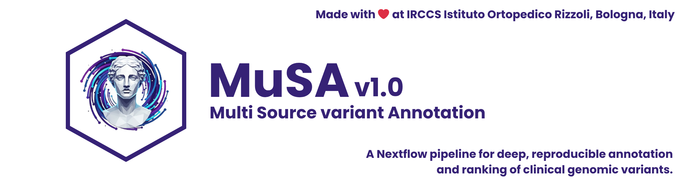
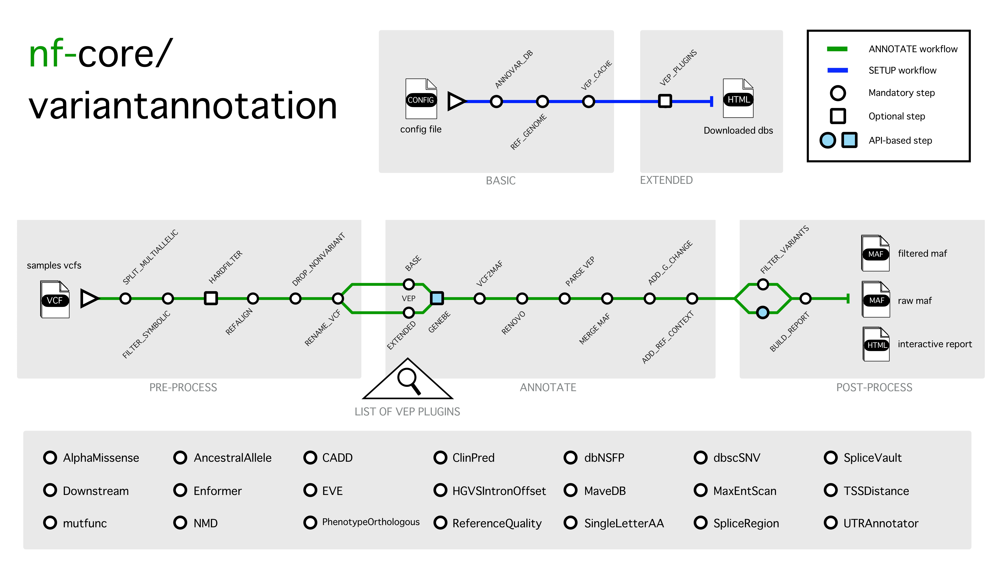

<h1>
  <picture>
    <source media="(prefers-color-scheme: dark)" srcset="docs/images/MuSA_logo_dark.png">
    
  </picture>
</h1>

[](https://doi.org/10.5281/zenodo.XXXXXXX)
[](https://www.nf-test.com)

[](https://www.nextflow.io/)
[](https://github.com/nf-core/tools/releases/tag/3.5.1)
[](https://docs.conda.io/en/latest/)
[](https://www.docker.com/)
[](https://sylabs.io/docs/)
[](https://cloud.seqera.io/launch?pipeline=https://github.com/MuSA)


## Introduction

**MuSA (Multi-Source variant Annotation)** is an nf-core-oriented Nextflow pipeline that provides a fully automated, end-to-end framework for variant interpretation.
Based on the findings in the sources, MuSA offers several innovations that distinguish it from, and in many aspects make is superior to, existing tools:
Automated Resource Management: MuSA eliminates the manual effort and reproducibility issues
inherent in standalone VEP or ANNOVAR workflows by fully automating the setup of annotation
resources, including 20 curated VEP plugins and the full dbNSFP distribution.

- *Advanced VUS Reclassification:* A standout feature of MuSA is its integration of the RENOVO machine-learning model. 
By applying a novel linear transformation to RENOVO scores, the pipeline actively shifts
Variants of Uncertain Significance (VUS) toward actionable pathogenic or benign extremes—a capability
not typically found in standard automated pipelines.

- *Dual-Output for AI Research and Clinical Review:* Unlike lighter clinical reporting tools, MuSA generates
deeply annotated, AI-ready MAF files containing up to 950 annotation columns, systematically
organized for deep computational research. Simultaneously, it produces interactive HTML reports with
HPO-matched gene panels, streamlining results for clinical teams.

- *Superior Clinical Utility vs. Broad Pipelines:* While broad pipelines like MuSA/sarek focus on processing
breadth, MuSA is uniquely dedicated to annotation completeness. It specifically addresses the
"unsuitable verbosity" of default VEP outputs by focusing on MANE transcript selection and HPO-driven
filtering to ensure results are diagnostic-ready.


The pipeline takes as input a samplesheet referencing raw (unannotated) VCF files and outputs consolidated annotation files suitable for clinical research, reporting, or input to downstream workflows.
If Human Phenotype Ontology (HPO) terms are provided for individual patients, an additional phenotype-prioritized MAF is generated using HPO-based gene panel filtering.



### Default pipeline key parameters

- **`--build`**  
  Genome build to use (default: `hg38`).

- **`--input`**  
  Path to the samplesheet containing input VCF files.

- **`--outdir`**  
  Directory where all results will be written.

- **`--workflow`**  
  Workflow to run: `setup` or `annotate`.

- **`--vcf_format`**  
  Format of input VCF files. Supported: `sarek`, `multicaller`, `dragen`, `iontorrent`.

- **`--center`**  
  Optional sequencing center identifier added to output files.

- **`--skip_bcftools`**  
  Allows user to skip the bcftools-based pre-processing of vcf files.

- **`--offline`**  
  If true, no external API call will be performed.

- **`--drop_benign`**  
  If true, all variants reported as "benign" or "likely benign" in Clinvar will be dropped in the filtered MAF file.

- **`--max_freq`**  
  Optional maximum population frequency threshold. If null, no variant will be dropped based on frequency.

- **`--panel`**  
  Optional panel name to be used in the last filtering step.
  
#### Genebe parameters *(required when `--offline false`)*

- **`--gb_user`**  
  Genebe account username.

- **`--gb_api_key`**  
  Genebe API key.

- **`--http_proxy`**, **`--https_proxy`**  
  Proxy settings, only if required by your system.

  


#### VEP and plugin parameters

- **`--n_core`**  
  Number of cores used by VEP (default: `16`).

- **`--download_vep_plugins`**  
  Download VEP plugins during the setup workflow (`true/false`).

- **`--use_vep_plugins`**  
  Enable VEP plugin usage during the annotation workflow (`true/false`).

- **`--data_dir`**  
  Directory containing all the data downloaded during the setup step.

- **`--annovar_software_dir`**  
  Directory containing the annovar software folder (path/to/annovar).


## Getting started

### 1a. Setup

Before annotating any dataset, the pipeline requires a **setup step** to download the minimal required databases and reference files. This ensures the pipeline can run correctly. 
**Important:** Users must independently obtain access to an ANNOVAR license, download the software from the official source, and install it according to its licensing terms.

**Licensing and data usage notice:**  
Users must independently obtain access to an ANNOVAR license, download the software from the official source, and install it according to its licensing terms.
While we provide a link to download the *dbNSFP academic* database for convenience, users are solely responsible for complying with its license terms. In particular, dbNSFP academic is restricted to **non-commercial use**, and any usage must adhere to the conditions specified by its authors. Ensure that your use case is compliant before downloading and integrating the resource.

Run the setup workflow:

```bash
nextflow run main.nf \
    -profile <docker/singularity> \
    --workflow setup \
    --download_vep_plugins=<true/false> \
    --data_dir="../data/"
```

### 1b. Test run

Now, you can run your first test using:

```bash
nextflow run main.nf \
   -profile test,<docker/singularity> \
   --use_vep_plugins = <true/false> \
   --annovar_software_dir = <path/to/annovar> \
   --outdir <OUTDIR>
```

### 2. Using your own data

If you want to annotate your own vcf file, make sure you prepare a samplesheet with this format:

| patient      | sample_type | sample_file         | hpo          |
|-------------|------------|-------------------|-------------|
| patient_code | tissue     | path/to/file.vcf.gz | HP:code (optional) |

**Columns:**

- `patient`: Unique identifier for the patient  
- `sample_type`: Type of sample (blood, saliva, tissue, etc.)  
- `sample_file`: Full path to the unannotated VCF file  
- `hpo`: Optional HPO term(s) for phenotype-based filtering  

> [!WARNING]
> By default, the entire pipeline is set to run with `--offline = true`.
This will skip the Genebe and HPO API-based annotations.
If you want to use Genebe, please provide `--gb_user` and `--gb_api_key` which can be obtained for free [here](https://genebe.net/signup). Only then, you can run with `--offline = false` and provide the Genebe params.


```bash
nextflow run main.nf \
  -profile  <docker/singularity> \
  --workflow annotate \
  --use_vep_plugins=<true/false> \
  --data_dir=<path/to/data> \
  --annovar_software_dir=<path/to/annovar> \
  --vcf_format=<sarek/multicaller/dragen/iontorrent> \
  --input  <path/to/samplesheet.csv>  \
  --outdir <OUTDIR>
```

## Pipeline output

MuSA generates two complementary outputs: comprehensive MAF files for computational analysis and interactive HTML reports for clinical interpretation.

*MAF files* contain up to ~950 annotation columns per variant, including population frequencies (e.g. gnomAD, TOPMed), pathogenicity predictions (e.g. REVEL, CADD, AlphaMissense), splicing scores (e.g. SpliceAI), clinical annotations (e.g. ClinVar, OMIM), gene constraint metrics, ACMG/AMP evidence, and RENOVO pathogenicity scores.

*HTML reports* provide an interactive overview with: (i) a summary panel (patient metadata and variant counts), (ii) a sortable/filterable variant table with key annotations, and (iii) maftools-based visualizations (e.g. mutation distributions, oncoplots, Ti/Tv ratios).

## Credits

MuSA was written by D. Scognamiglio at IRCCS Istituto Ortopedico Rizzoli, Bologna, Italy.

We thank E. Bonetti for his extensive assistance in the development of this pipeline.

## Citations

<!-- If you use MuSA for your analysis, please cite it using the following doi: [10.5281/zenodo.XXXXXX](https://doi.org/10.5281/zenodo.XXXXXX) -->

An extensive list of references for the tools used by the pipeline can be found in the [`CITATIONS.md`](CITATIONS.md) file.

You can cite the `MuSA` publication as follows:
...
